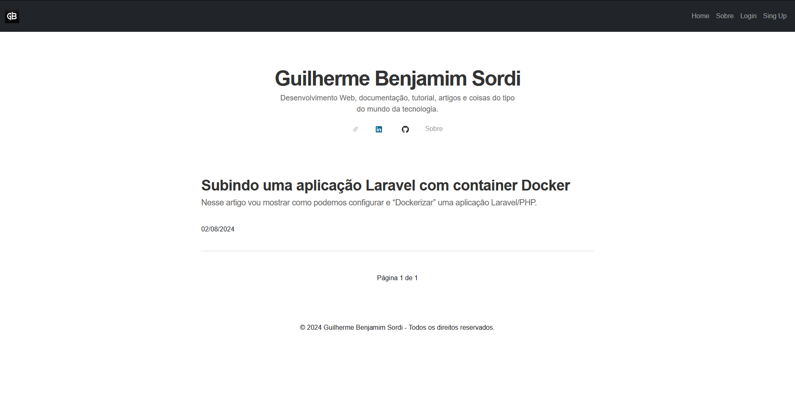
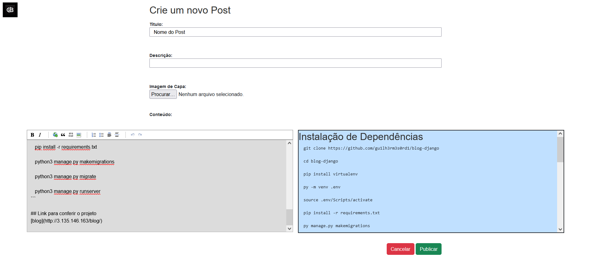
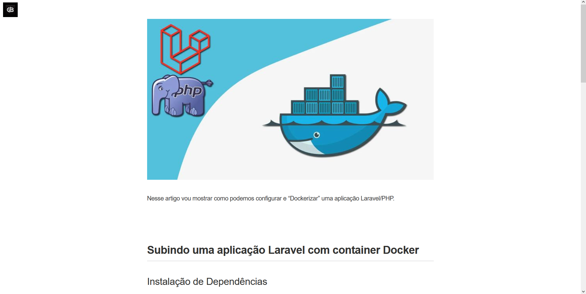
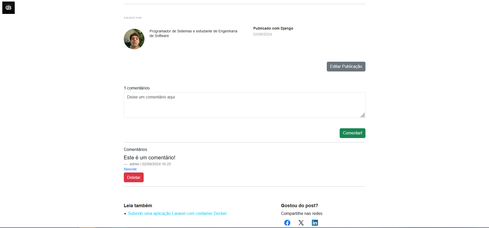

## Instalação de Dependências

```bash
  git clone https://github.com/gu1lh3rm3s0rd1/blog-django
  
  cd blog-django
  
  pip install virtualenv
  
  py -m venv .env
  
  source .env/Scripts/activate
  
  pip install -r requirements.txt

  python manage.py collectstatic

  py manage.py makemigrations

  py manage.py migrate


```

## Iniciando o Servidor

```bash
  py manage.py runserver
```

## Em ambientes Linux

```bash
   sudo apt update

   sudo apt install python3-venv

   git clone https://github.com/gu1lh3rm3s0rd1/blog-django

   cd blog-django

   python3 -m venv .env

   source .env/bin/activate

   pip install -r requirements.txt

   python manage.py collectstatic

   python3 manage.py makemigrations

   python3 manage.py migrate

   python3 manage.py runserver
```

## Link para conferir o projeto
Este projeto foi removido da instancia EC2 da Amazon.

## Demonstracao



Este blog foi criado com o objetivo de proporcionar uma plataforma dinâmica e fácil de usar para a criação e gerenciamento de postagens e artigos sobre qualquer assunto de interesse. Desenvolvido utilizando o framework Django, conhecido por sua robustez e flexibilidade, o blog oferece um sistema completo de CRUD (Create, Read, Update, Delete) que permite ao administrador criar, editar, visualizar e excluir postagens de maneira intuitiva.

### **Funcionalidades Principais:**

- **Sistema de Autenticação:** Apenas administradores autenticados têm acesso às funcionalidades de gerenciamento de conteúdo, garantindo a segurança e integridade das postagens.
- **CRUD Completo:** Ferramentas para criar, editar, visualizar e deletar postagens de forma prática e eficiente, com suporte a Markdown para estilização de conteúdo.
- **Comentários:** Os leitores podem interagir com o conteúdo, deixando comentários nas postagens. Cada comentário é moderado pelo administrador antes de ser publicado.
- **Design Responsivo:** Desenvolvido com Bootstrap, o blog oferece uma interface responsiva, garantindo que as postagens sejam visualizadas de forma otimizada em dispositivos móveis, tablets e desktops.
- **Integração com Redes Sociais:** Compartilhamento rápido de postagens diretamente nas principais redes sociais, ampliando o alcance do conteúdo.





### **Tecnologias Utilizadas:**

- **Python:** Linguagem de programação principal utilizada para o desenvolvimento do backend, garantindo a robustez e a escalabilidade do sistema.
- **Django:** Framework web que proporciona uma estrutura sólida para a criação de funcionalidades complexas de maneira simples e eficiente.
- **HTML/CSS/Bootstrap:** Para a construção de uma interface de usuário moderna e responsiva.
- **JavaScript:** Para adicionar interatividade e melhorar a experiência do usuário no frontend.
- **SQLite:** Bancos de dados suportados para armazenamento seguro e eficiente das postagens e informações de usuários.

### **Objetivo:**

Este blog é ideal para quem deseja compartilhar ideias, conhecimentos ou opiniões de maneira organizada e profissional, sem a necessidade de conhecimentos avançados em desenvolvimento web. Com uma arquitetura baseada em Python e Django, o sistema é facilmente expansível, permitindo a adição de novas funcionalidades conforme as necessidades evoluem.
